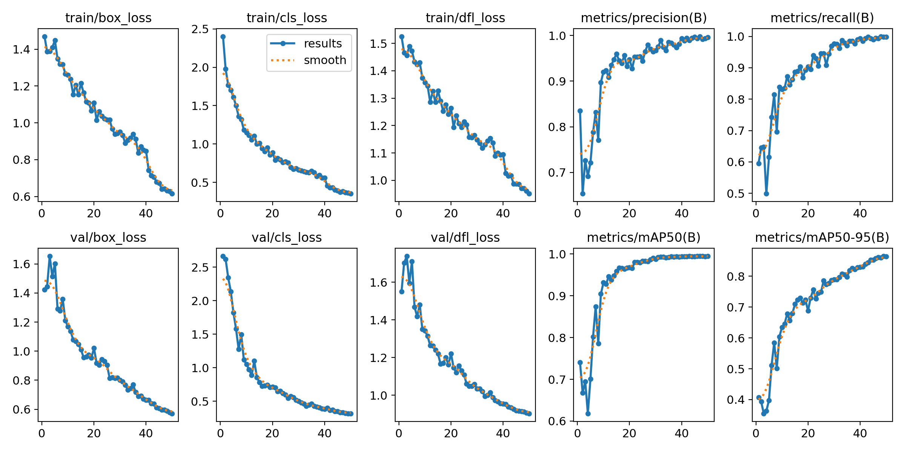
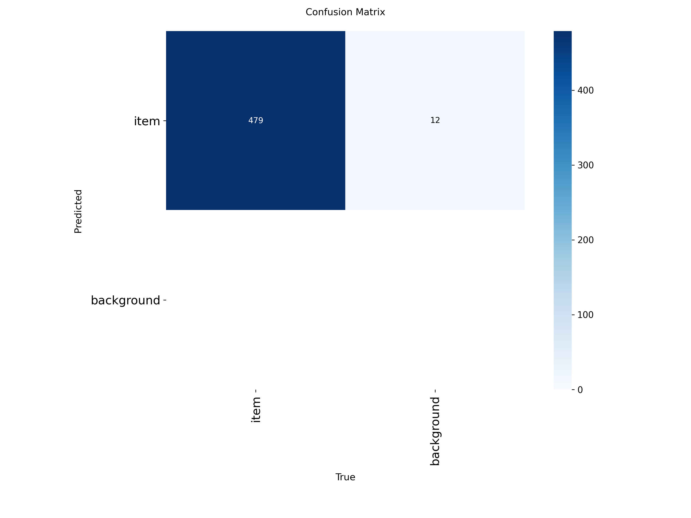

# Conflict-detection-from-CCTV-cameras
Дипломный (итоговый) проект (ВКР) по Цифровой кафедре.
Создание системы, способной автоматически распознавать физические конфликты на видеозаписях с камер наблюдения с помощью ИИ.

# 🛡️ Conflict Detection: Система распознавания конфликтов

  

##  Суть проекта
Данный проект представляет собой интеллектуальную систему мониторинга видеопотока, предназначенную для автоматического обнаружения физических конфликтов (драк) и опасных ситуаций. Система позволяет снизить нагрузку на операторов видеонаблюдения и минимизировать время реакции на происшествия.

> **Как это работает:** В основе системы лежит архитектура **YOLOv8-Pose**, которая детектирует скелеты людей. Анализ динамики изменения ключевых точек скелета позволяет классифицировать действие как конфликтное с высокой точностью.

---

## Стек технологий
*   **Язык:** `Python 3.10+`
*   **Computer Vision:** `OpenCV`, `Ultralytics YOLOv8`
*   **Web Framework:** `Flask`
*   **Data Processing:** `NumPy`, `Pandas`

---
## Структура проекта
Проект организован для обеспечения удобной масштабируемости и поддержки:

*   `/dataset` — набор данных для обучения и тестирования модели.
*   `/model` — веса обученных нейросетевых моделей.
*   `/runs` — результаты обучения модели.
*   `/static` — файлы дизайна (CSS, изображения, логотипы).
*   `/templates` — HTML-шаблоны для веб-интерфейса.
*   `/videos` — тестовые видеофрагменты для проверки системы.
*   `main.py` — основной скрипт запуска веб-сервера.
*   `requirements.txt` — список всех необходимых библиотек.

---
##  Инструкция по запуску
Чтобы запустить проект локально, выполните следующие шаги:

1. **Клонируйте репозиторий:**
   `git clone [ссылка_на_ваш_репозиторий]`

2. **Установите зависимости:**
   `pip install -r requirements.txt`

3. **Запустите проект:**
   `python main.py`

4. **Доступ к системе:**
   Откройте браузер и перейдите по адресу `http://127.0.0.1:5000`.

---

## Метрики качества модели
Модель была обучена на 50 эпохах. Ниже приведены итоговые показатели эффективности системы, подтверждающие высокую точность распознавания:

### Итоговые показатели (на 50-й эпохе):
| Метрика | Значение |
| :--- | :--- |
| **Precision** | 0.997 |
| **Recall** | 0.994 |
| **mAP@50** | 0.999 |
| **mAP@50-95** | 0.864 |

### Графики обучения
*На графиках видно стабильное снижение функции потерь (loss) и рост метрик точности (precision/recall), что свидетельствует об успешной сходимости модели.*

  

### Матрица ошибок (Confusion Matrix)
Матрица показывает, что модель практически не допускает ошибок при классификации объектов на тестовой выборке.

  

---
## Ссылка на Google Drive

https://drive.google.com/drive/folders/1ldrVXTNAJnfQUAtySjdWKUtUMj3fp_HW?usp=sharing
---
*Проект разработан в рамках Цифровой кафедры УГГУ.*
